# Janji
Saya Muhammad Dzaka Indrianto dengan NIM 2508755 mengerjakan Tugas Praktikum 1 dalam mata kuliah Desain dan Pemrograman Berorientasi Objek untuk keberkahanNya maka saya tidak melakukan kecurangan seperti yang telah dispesifikasikan. Aamiin.

# STRUKTUR FOLDER REPOSITORI
- **CPP/** : Berisi file `SesiTayang.cpp` dan `Main.cpp`
- **Java/** : Berisi file `SesiTayang.java` dan `Main.java`
- **Python/** : Berisi file `SesiTayang.py` dan `Main.py`
- **PHP/** : Berisi file `SesiTayang.php`, `Main.php`, dan folder `images/` untuk poster lokal
- **Dokumentasi/** : Berisi file *screenshot* / *screenrecord* output program
- **README.md** : File dokumentasi proyek

# FITUR UTAMA
- **Tambah Data**: Menambah objek sesi tayang bioskop baru.
- **Tampilkan Data**: Menampilkan semua objek sesi tayang yang tersimpan.
- **Update Data**: Mengubah data objek sesi tayang berdasarkan identifier unik (ID Sesi).
- **Hapus Data**: Menghapus objek sesi tayang berdasarkan identifier unik (ID Sesi).
- **Cari Data**: Mencari spesifikasi satu objek sesi tayang berdasarkan ID Sesi.

# Error Handling di C++, Java, dan Python Program
- Peringatan Input Menu tidak valid  
  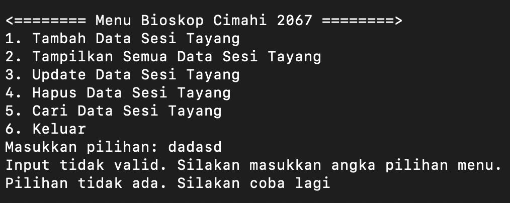
  
- Peringatan ketika mencari, menghapus, mengupdate data yang tidak ada 
  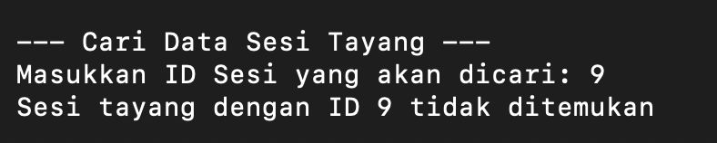
  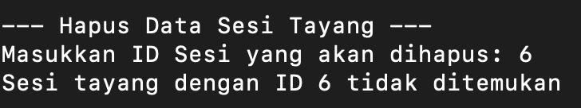
  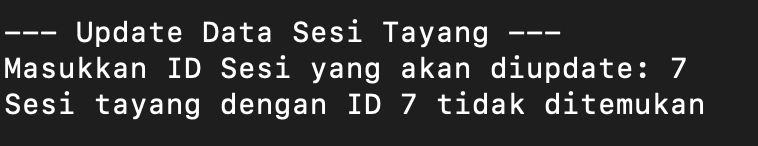

- Peringatan ketika input id conflict dan input Harga bukan angka  
  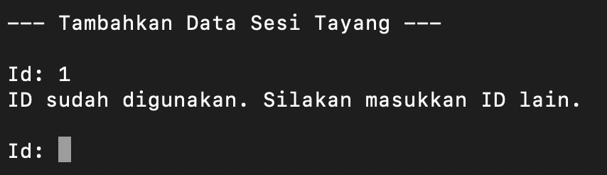
  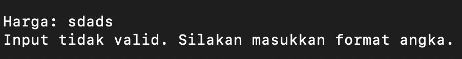

# Error Handling di PHP
- Peringatan ID input conflict  
  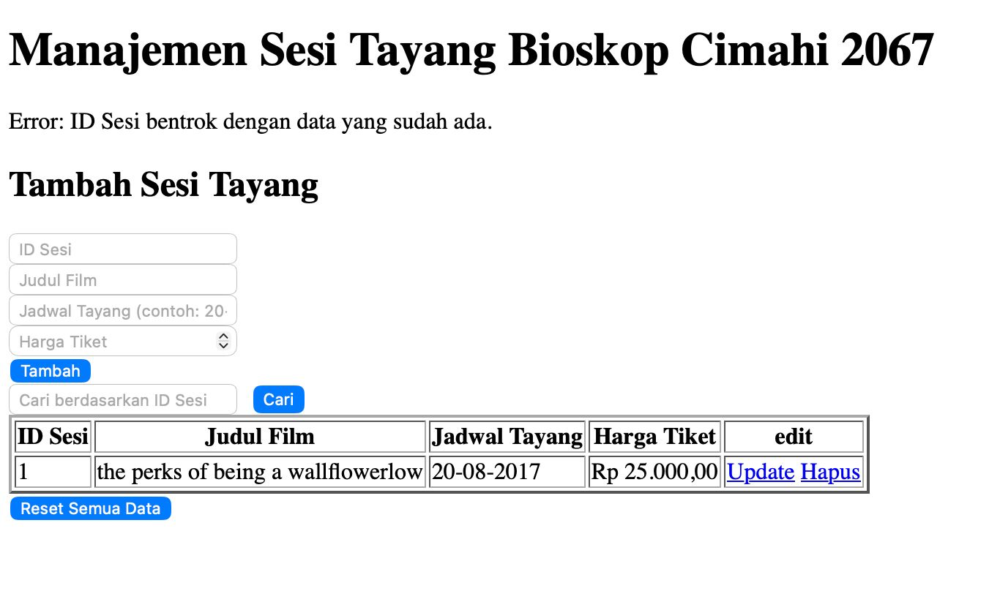

- Peringatan Harga Negatif  
  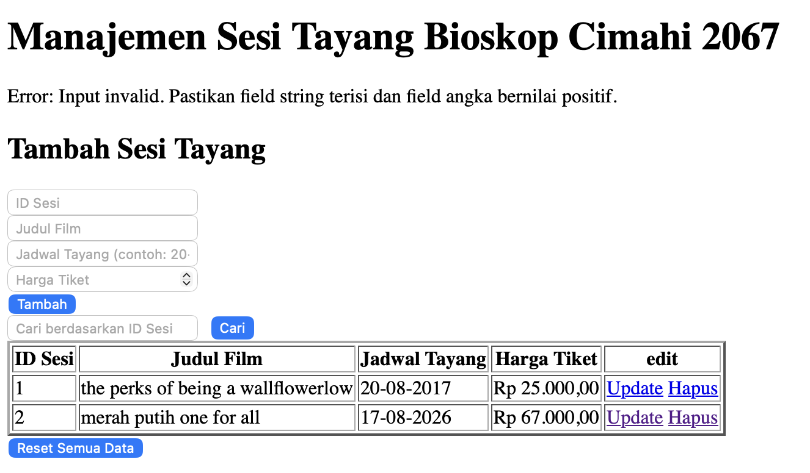
  
# DOKUMENTASI OUTPUT

## Output Program C++,Java, dan Python
### Menambahkan data
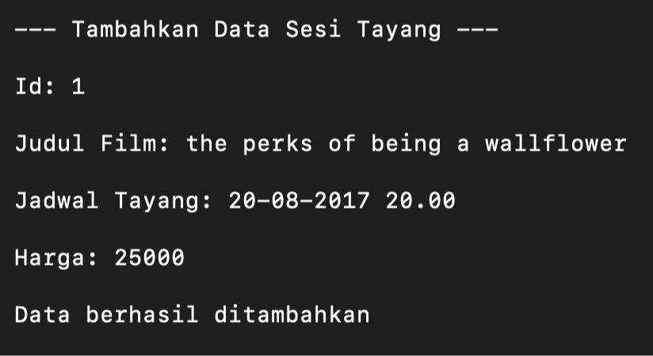

### Menampilkan semua data
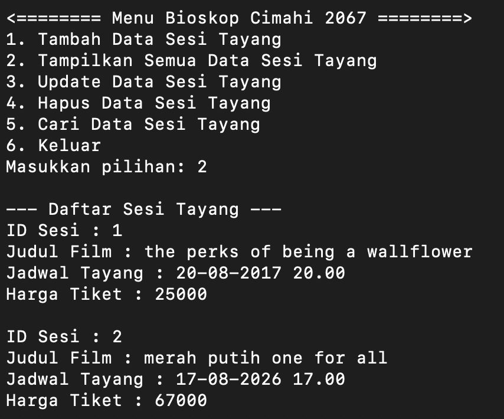

### Memperbarui data
atribut yang tidak ingin diubah bisa diskip dengan langsung menekan enter(tidak mengubah atribut sebelumnya)  
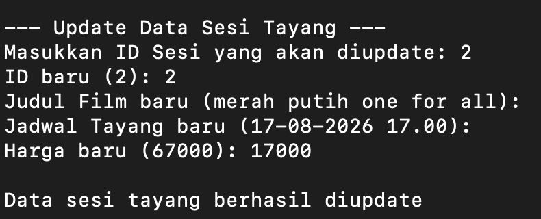

### Mencari data
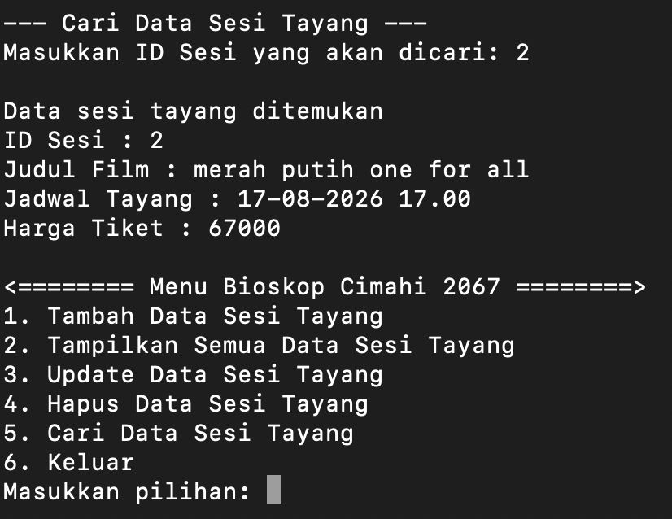

### Menghapus data
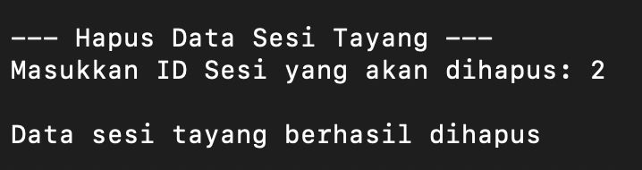

## Output Program PHP
### Menambahkan data
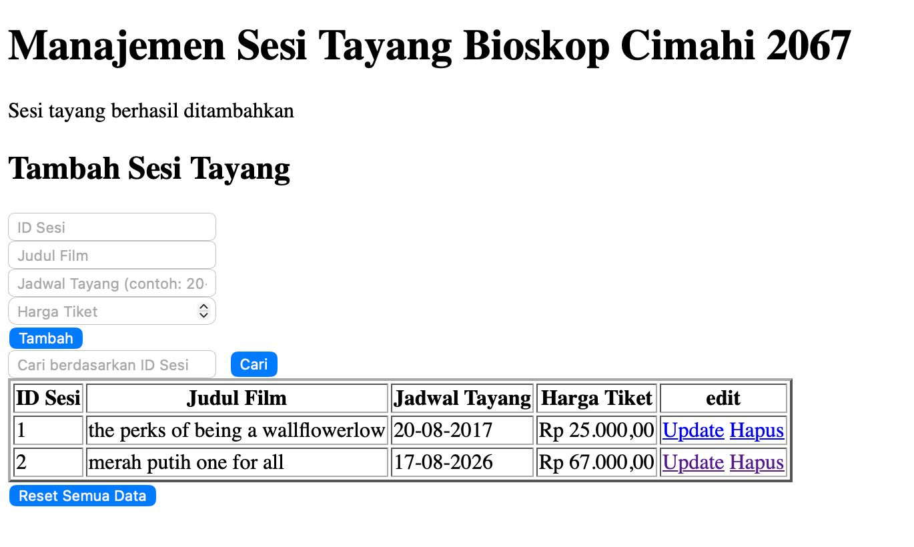

### Memperbarui data
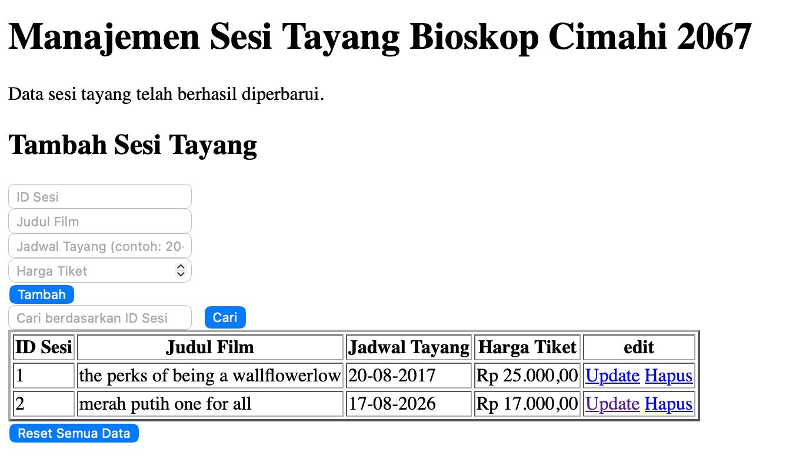

### Mencari data
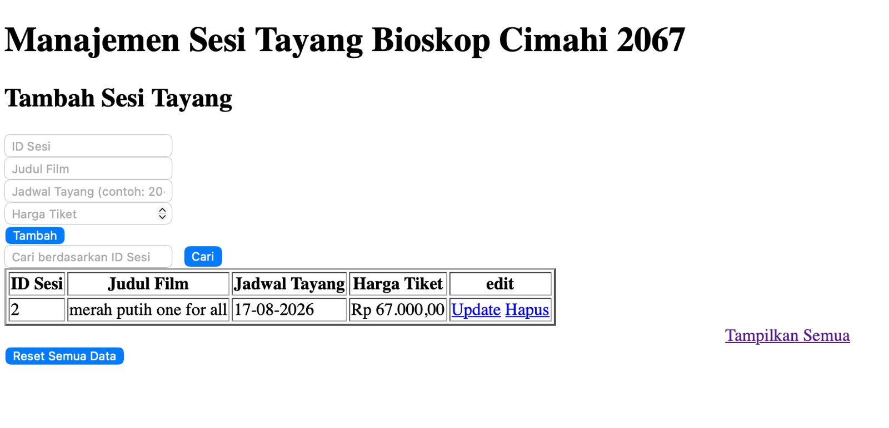

### Menghapus data
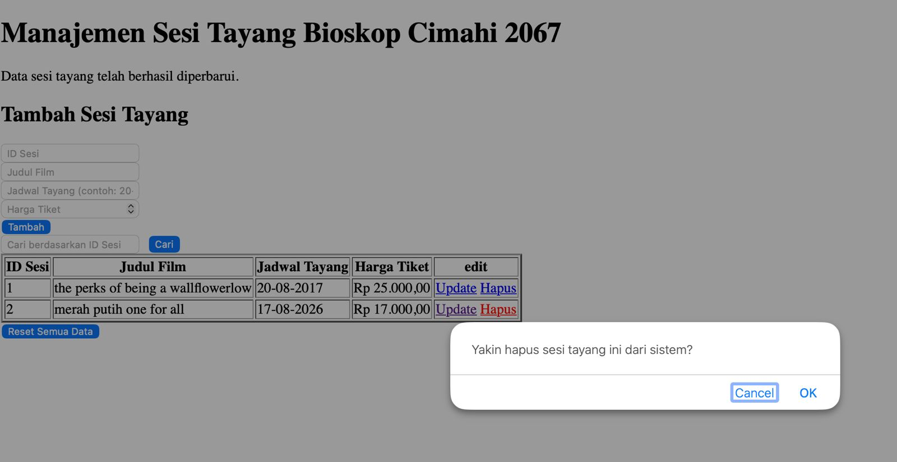

### Menghapus semua data
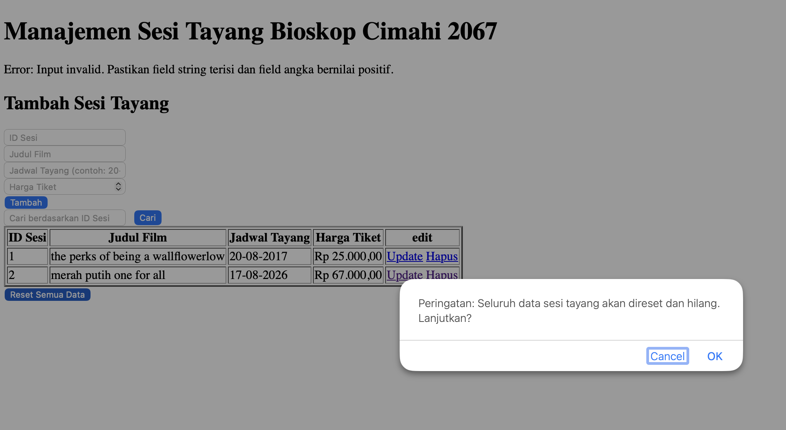
